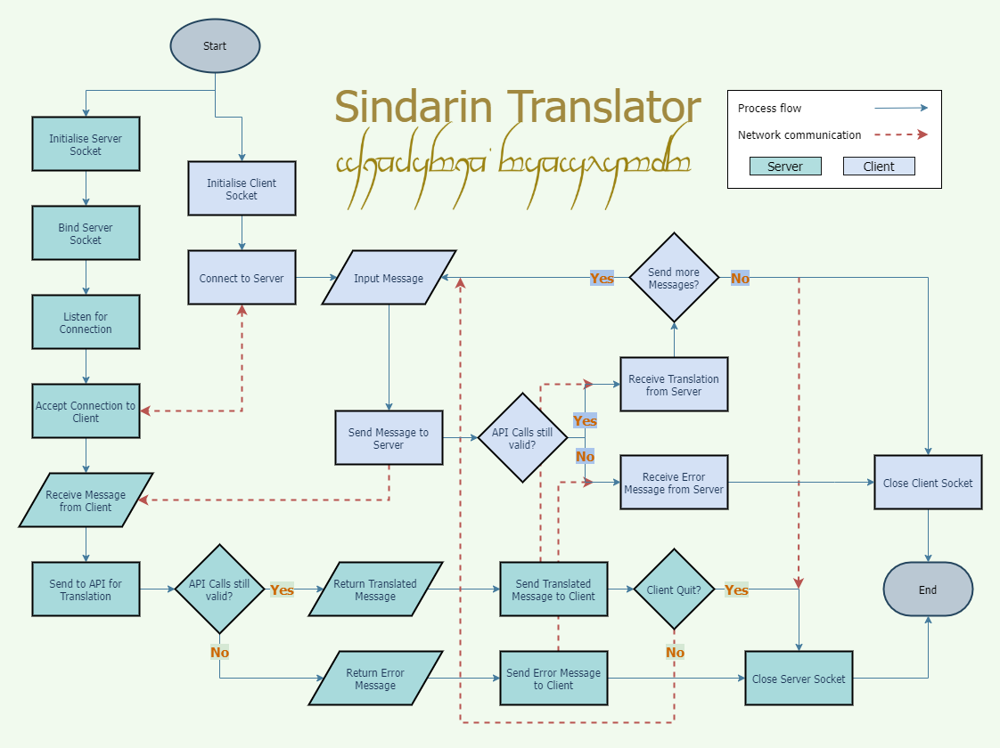
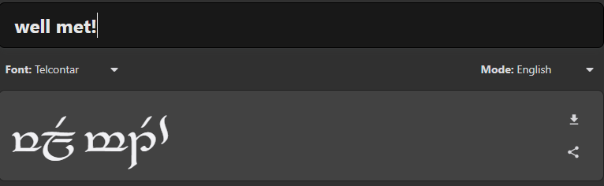

# Sindarin Translator
CCC-2021 T2A3 - Networking Algorithm Application - Karl Alberto

# Project Details

## Description

This application is designed as a simple translator service that runs between a client and server. After establishing a connection between the client and server, the user is prompted to input a message they would like to translate. The user's message is then fed into a _Sindarin_ Translation API by the server. The server sends back that message in Sindarin (one of the _Elvish_ languages developed by J.R.R. Tolkien).

## Application Structure

### Flowchart

Below is the flowchart that shows the control flow for the translator.

### Classes and Class Methods

### Functions

### Error Handling

### Testing

## Progress

## Future Development Plans

### GUI

### Extra Translations

### Tengwar Elvish Script Output
In the future, adding functionality to display the _"Tengwar"_ script can be added:
