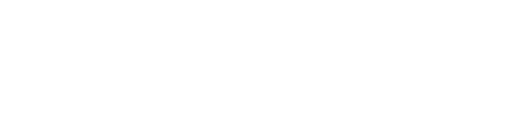
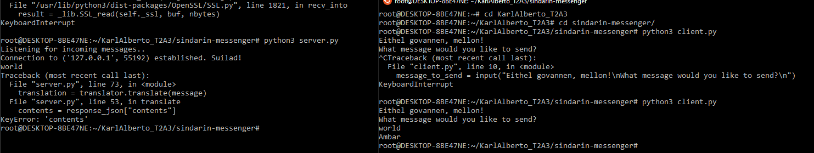

# Sindarin Translator
CCC-2021 T2A3 - Networking Algorithm Application - Karl Alberto

# Project Details

## Description

This application is designed as a simple translator service that runs between a client and server. After establishing a connection between the two, the user is prompted to input a message they would like to translate. The user's message is then fed into a _Sindarin_ (one of the _Elvish_ languages developed by J.R.R. Tolkien) Translation API by the server. The server then sends back that user message in Sindarin.

As this program runs in the terminal, Sindarin was chosen as the output language, as this provided easy transliteration of the language using the English alphabet (technically making this a transliteration app). Future development plans for this project include a separate GUI that will allow for _Tengwar_ Elvish scripts to be displayed.

The way this program has been written will also make it easier to add extra language API's in the future, with _Quenya_ (another Elvish language developed by Tolkien) being on top of that list. The translation API is treated as a separate object from the _Translator_ `Class` so that the program can add these languages without the need to tweak the parent class, or make significant changes to that part of the code.

Since many other _ConLangs_ (Constructed Languages) have resources that can be found online, those with available API's can be added to the program as extra _Child Classes_ of the main Translator class used in the program. Some examples include _Klingon_, _Dothraki_, _Simlish_, and more from many other franchises! When these extra languages are added, we'll have to rename the program to _"ConLang Translator"_!

The client program asks the user to input a message they would like to have translated right after running it, so the only other addition to make to the program (outside of error handling) will be to give the user the ability to choose between target translations.

(Note: the _Google Translate_ API can also be used within this program, but that is currently outside of the scope of this project... and less pop-culture geeky.)

## Application Structure

### Flowchart

Below is the flowchart that shows the control flow for the translator.

### Dependencies and App Requirements

* Server requires `import socket` and `import requests`
* Client requires `import socket`

### Classes and Class Methods

#### Server

* `class MessageServer`
    * Initialises and binds socket; listens for, then accepts connection from client.
    * Receives messages from client; sends translated message back.
    * Closes socket when prompted by client, or error encountered.

* `class Translator`
    * Initialises the translator and handles output from the translation API
    * Returns the result for `MessageServer` to send.

* `class SindarinTranslator`
    * Child class of `Translator`; provides access to the translation API.

#### Client

* `class TranslationClient`
    * Initialises socket and connects to server.
    * Accepts user input for translation request; sends to server.
    * Receives translated message (or error message for API limit) from server.
    * Closes socket on '/quit' prompt, or API call limit error.

### Functions

#### Server

* `def main()`
    * Function starts the program; exits program on '/quit' prompt or error.

#### Client

* `def main()`
    * Function starts main program loop; exits on '/quit' prompt or error.

### Error Handling

#### Client

* Program catches when API call limit reached and returns error message to user. Closes socket and exits the program; also triggers socket close and program exit server-side.

## Progress

Select screenshots at programming milestones:

## Future Development Plans

### GUI

* Plans to implement a GUI so that text output can be displayed in more _"Elvish"_ looking fonts; including Tengwar (example below).
* Exploring the following modules to implement more features and GUI:
    * Tkinter
    * Pygame
    * Kivy
    * PySimpleGUI

### Extra Translations

* As mentioned earlier, planning to include more child classes that handle separate language API's where applicable, including:
    * Quenya
    * Orcish
    * Klingon
    * Dothraki
    * Valyrian
    * Simlish
    * Dovahzul

### Tengwar Elvish Script Output Examples

* Tengwar GUI output. English and Elvish (Sindarin and Quenya) both output letter-by-letter in Tengwar script, 

"Well met!" in English, in Tengwar script from https://www.fontspace.com/tengwar-cursive-font-f2242/

"Well met!" in Sindarin ("Eithel govannen!"), in Tengwar script from https://www.fontspace.com/tengwar-cursive-font-f2242/

---

Karl Alberto | 2021