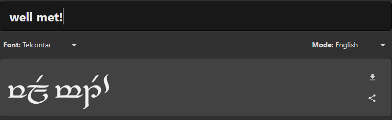

# Sindarin Messenger
CCC-2021 T2A3 - Algorithm Application - Karl Alberto

# Software Development Plan

## Description

This application is designed around a simple chat/messenger application between users (via a server). The extra layer of flavour is that it will also output a translation of each users' message in _"Sindarin"_ language (one of the _Elvish_ languages developed by Tolkien).

The chat will work by establishing a connection between client/s and server. As this will run via terminal, the Sindarin output will be using plain text as well; i.e. English text will be translated to phonetic Sindarin.

Having text translate and display as Sindarin will also allow the program to act as a basic translation app for a single user as well.

In the future, adding functionality to display the _"Tengwar"_ script can be added:

## Flowchart

Below is the flowchart that shows how the program will run; including how it handles input/output, error handling, the app's dependancies:

